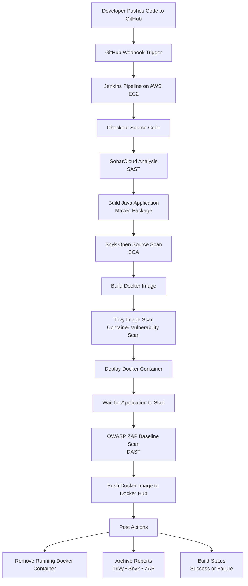

# Java DevSecOps CI/CD Pipeline with Jenkins, Docker, SonarCloud, Snyk, Trivy & OWASP ZAP

---


A production-style DevSecOps CI/CD pipeline for a containerized Java application, integrating automated build, security testing (SAST, SCA, container image scanning, and DAST), and deployment using Jenkins, Docker, SonarCloud, Snyk, Trivy, OWASP ZAP, and AWS EC2.

---

## Overview

This project demonstrates a production-style DevSecOps CI/CD pipeline for a containerized Java application running on an AWS EC2-hosted Jenkins server.

The pipeline automates application build, security testing, containerization, and deployment while integrating security throughout the software delivery lifecycle using the Shift-Left Security approach.

The pipeline integrates:
- Continuous Integration using Jenkins
- Static Application Security Testing (SAST) using SonarCloud
- Software Composition Analysis (SCA) and continuous dependency monitoring using Snyk
- Containerization using Docker
- Docker image vulnerability scanning using Trivy
- Dynamic Application Security Testing (DAST) using OWASP ZAP Baseline Scan
- Automated Docker image build and deployment
- Deployment on AWS EC2 (Ubuntu)

---

## Architecture


---

## Technology Stack

| Category | Technology |
|----------|------------|
| **Cloud Platform** | AWS EC2 (Ubuntu) |
| **Pipeline Trigger** | GitHub Webhook |
| **CI/CD** | Jenkins |
| **Source Control** | GitHub |
| **Build Tool** | Maven |
| **Application Runtime** | Java 17 |
| **Jenkins Runtime** | JDK 21 |
| **Containerization** | Docker |
| **Container Registry** | Docker Hub |
| **Static Application Security Testing (SAST)** | SonarCloud |
| **Software Composition Analysis (SCA)** | Snyk Open Source (SCA & Continuous Dependency Monitoring) |
| **Container Image Security** | Trivy |
| **Dynamic Application Security Testing (DAST)** | OWASP ZAP Baseline Scan |

---

## Jenkins Pipeline Flow

```text
Developer Push
      │
      ▼
GitHub Repository
      │
      ▼
GitHub Webhook Trigger
      │
      ▼
Jenkins Pipeline (AWS EC2)
      │
      ▼
Checkout Source Code
      │
      ▼
SonarCloud Analysis (SAST)
      │
      ▼
Build Java Application (Maven)
      │
      ▼
Snyk Open Source Scan (SCA)
      │
      ▼
Build Docker Image
      │
      ▼
Trivy Image Scan
      │
      ▼
Deploy Docker Container
      │
      ▼
Application Health Check
      │
      ▼
OWASP ZAP Baseline Scan (DAST)
      │
      ▼
Push Docker Image to Docker Hub
      │
      ▼
Archive Security Reports
```
---

## Security Testing Pipeline

### 1. Static Application Security Testing (SAST)

**Tool:** SonarCloud

The pipeline performs static source code analysis immediately after checking out the application source code.

SonarCloud scans the application's source code for:
- Security vulnerabilities
- Code smells
- Bugs
- Maintainability issues
- Security Hotspots
- Quality Gate validation

This ensures insecure code is detected early and provides developers with feedback before packaging the application.

---

### 2. Software Composition Analysis (SCA)

**Tool:** Snyk

After successfully building the Maven application, Snyk performs Software Composition Analysis (SCA) by scanning the application's open-source dependencies for known Common Vulnerabilities and Exposures (CVEs).

The pipeline uses:

- `snyk test` to identify dependency vulnerabilities during the CI pipeline and generate a JSON security report.
- `snyk monitor` to upload a project snapshot to Snyk, enabling continuous dependency monitoring, vulnerability tracking, and remediation recommendations from the Snyk dashboard.

The scan includes:

- Dependency vulnerability detection
- CVE identification
- Severity classification
- Continuous dependency monitoring
- JSON report generation

---

### 3. Docker Image Vulnerability Scan

**Tool:** Trivy

Once the Docker image has been built, Trivy scans the image for operating system and package vulnerabilities.

The scan is configured to detect:
- HIGH severity
- CRITICAL severity
- Ignore unfixed vulnerabilities
- Output report generation

---

### 4. Dynamic Application Security Testing (DAST)

**Tool:** OWASP ZAP Baseline Scan

After deploying the Docker container locally on the Jenkins EC2 instance, OWASP ZAP performs an automated baseline scan against the running application.

The scan checks for common web security issues including:
- Missing security headers
- Cookie security
- Information disclosure
- Passive vulnerability detection
- General OWASP Top 10 related findings

---

## Pipeline Stages

The Jenkins pipeline executes the following stages in sequence to build, secure, containerize, test, and publish the application.

| Stage | Purpose |
|--------|---------|
| **📥 Checkout Source Code** | Retrieves the latest application source code from GitHub. |
| **🔍 SonarCloud Analysis (SAST)** | Performs static code analysis and validates the SonarCloud Quality Gate. |
| **🔨 Build Java Application** | Compiles, tests, and packages the application using Maven. |
| **📦 Snyk Dependency Scan (SCA)** | Scans third-party dependencies for known vulnerabilities (CVEs), generates a JSON report, and uploads a project snapshot for continuous dependency monitoring. |
| **🐳 Build Docker Image** | Builds the Docker image containing the packaged Java application. |
| **🛡️ Trivy Image Scan** | Scans the Docker image for HIGH and CRITICAL vulnerabilities. |
| **🚀 Deploy Docker Container** | Deploys the application as a Docker container on the Jenkins EC2 instance. |
| **❤️ Application Health Check** | Verifies the application is running and accessible before continuing. |
| **🌐 OWASP ZAP Baseline Scan (DAST)** | Performs passive web application security testing against the running application. |
| **☁️ Push Docker Image** | Pushes the versioned image and `latest` tag to Docker Hub. |
| **📄 Archive Security Reports** | Archives Trivy, Snyk, and OWASP ZAP reports as Jenkins build artifacts. |
| **🧹 Cleanup** | Removes the running Docker container after the pipeline completes. |

---

## Security Reports

The Jenkins pipeline archives the following security reports as Jenkins build artifacts after each successful execution.

| Report | Description |
|---------|-------------|
| **snyk-report.json** | Software Composition Analysis (SCA) report generated by Snyk. |
| **trivy-report.txt** | Container image vulnerability report generated by Trivy. |
| **zap-report.html** | Dynamic Application Security Testing (DAST) report generated by OWASP ZAP Baseline Scan. |

In addition to generating `snyk-report.json`, the pipeline uploads a dependency snapshot to Snyk using `snyk monitor`, enabling continuous monitoring of newly disclosed vulnerabilities through the Snyk dashboard.

---
## Screenshots

Project screenshots are available in the following folders:

- 📁 [AWS](screenshots/aws/)
- 📁 [Jenkins](screenshots/jenkins/)
- 📁 [Pipeline](screenshots/pipeline/)
- 📁 [SonarCloud](screenshots/sonarcloud/)
- 📁 [Snyk](screenshots/snyk/)
- 📁 [Trivy](screenshots/trivy/)
- 📁 [OWASP ZAP](screenshots/zap/)


For detailed implementation steps, see the [documentation](docs/) directory.

---

## Documentation

Detailed setup guides, configuration steps, and pipeline implementation are available in the `docs` folder.

- [AWS EC2 & Jenkins Server Setup](docs/01-aws-jenkins-setup.md)
- [SonarCloud Integration (SAST)](docs/02-sonarcloud-sast-setup.md)
- [Snyk Integration (Software Composition Analysis)](docs/03-snyk-scan-setup.md)
- [Trivy Container Security](docs/04-trivy-container-security.md)
- [OWASP ZAP Baseline Scan (DAST)](docs/05-owasp-zap-dast.md)
- [Jenkins DevSecOps Pipeline Walkthrough](docs/06-jenkins-pipeline-explanation.md)
- [Troubleshooting Guide](docs/07-troubleshooting.md)

---

## Getting Started

### Prerequisites

Before running this project, ensure you have the following installed and configured:

- AWS EC2 Ubuntu Server
- Jenkins
- Docker
- Java 21 (Jenkins runtime)
- Java 17 (Application build)
- Maven
- Git
- Docker Hub account
- SonarCloud account
- Snyk account

### Clone the Repository

```bash
git clone https://github.com/Jefferson-ohis1/java-devsecops-pipeline.git
cd java-devsecops-pipeline
```

### Configure Jenkins

Configure Jenkins by following the setup guides available in the `docs/` directory:

- AWS EC2 & Jenkins Server Setup
- SonarCloud Integration
- Snyk Integration
- Trivy Integration
- OWASP ZAP Integration

### Run the Pipeline

Once Jenkins is configured:

1. Push changes to the GitHub repository to trigger the webhook, **or**
2. Trigger the pipeline manually from the Jenkins dashboard.

The pipeline will automatically:

- Checkout the source code
- Run SonarCloud (SAST)
- Build the application with Maven
- Perform Snyk dependency scanning (SCA)
- Upload the dependency snapshot to Snyk for continuous monitoring
- Build the Docker image
- Scan the image with Trivy
- Deploy the Docker container
- Perform an OWASP ZAP Baseline Scan (DAST)
- Push the Docker image to Docker Hub
- Archive security reports
- Clean up the running container

---

## DevSecOps Practices Demonstrated

This project demonstrates the practical application of modern DevSecOps principles, including:

- End-to-end CI/CD pipeline automation with Jenkins
- Shift-Left Security through integrated security testing
- Continuous Integration (CI) using GitHub Webhooks
- Pipeline-as-Code using a Jenkinsfile
- Static Application Security Testing (SAST)
- Software Composition Analysis (SCA)
- Container image vulnerability scanning
- Dynamic Application Security Testing (DAST)
- Secure Docker image build and deployment
- Secure credential management in Jenkins
- Automated security report archiving
- Automated pipeline cleanup

---

## Repository Structure

```text
.
├── docs/
│   ├── 01-aws-jenkins-setup.md
│   ├── 02-sonarcloud-sast-setup.md
│   ├── 03-snyk-scan-setup.md
│   ├── 04-trivy-container-security.md
│   ├── 05-owasp-zap-dast.md
│   ├── 06-jenkins-pipeline-explanation.md
│   └── 07-troubleshooting.md
├── screenshots/
├── src/
│   ├── main/
│   └── test/
├── Dockerfile
├── Jenkinsfile
├── pom.xml
├── README.md
└── .gitignore
```
---

## Learning Outcomes

By completing this project, I gained hands-on experience with:
- Implementing a secure production-style CI/CD pipeline using Jenkins.
- Integrating GitHub Webhooks for automated pipeline execution.
- Performing Static Application Security Testing (SAST) with SonarCloud.
- Performing Software Composition Analysis (SCA) and continuous dependency monitoring using Snyk Open Source.
- Building and tagging Docker images with Maven artifacts.
- Scanning Docker images for vulnerabilities using Trivy.
- Deploying a Dockerized Java application on an AWS EC2 instance.
- Performing Dynamic Application Security Testing (DAST) using OWASP ZAP Baseline Scan.
- Publishing versioned and `latest` Docker images to Docker Hub.
- Managing Jenkins credentials securely for external integrations.
- Archiving security scan reports as Jenkins build artifacts.
- Applying DevSecOps principles by integrating security throughout the CI/CD pipeline (Shift Left Security).
- Troubleshooting Jenkins, Docker, networking, and security scanning integrations.

---

## Future Improvements

Potential enhancements for this project include:

- Integrate Kubernetes for container orchestration and application deployment.
- Deploy the application to Amazon EKS or Amazon ECS instead of the Jenkins EC2 instance.
- Add Infrastructure as Code (IaC) using Terraform to provision AWS resources.
- Integrate Ansible for automated server configuration and application deployment.
- Configure Jenkins to fail the pipeline based on configurable security thresholds from SonarCloud, Snyk, Trivy, and OWASP ZAP.
- Implement automated deployment to separate staging and production environments.
- Add email or Slack notifications for pipeline status and security scan results.
- Store Docker images in Amazon Elastic Container Registry (ECR) as an alternative to Docker Hub.
- Integrate secret management using AWS Secrets Manager or HashiCorp Vault.
- Add JUnit-based unit tests and integrate JaCoCo to generate code coverage reports for SonarCloud analysis.

---

## Author

**Jefferson Ohis**

DevOps & Cloud Engineer | AWS Certified Cloud Practitioner

Passionate about building secure, automated, and scalable cloud infrastructure using DevOps and DevSecOps best practices.

- GitHub: [Jefferson-ohis1](https://github.com/Jefferson-ohis1)
- LinkedIn: [Jefferson Ohis](https://www.linkedin.com/in/jefferson-ohis-oviosu-5a982a168/)

---
