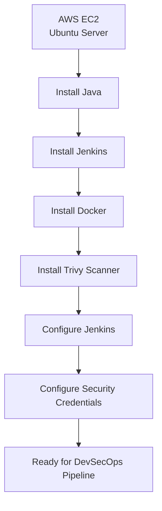

# AWS EC2 & Jenkins Server Setup
---
## Overview

This document describes how I provisioned an AWS EC2 Ubuntu server and configured it as a Jenkins automation server for a complete DevSecOps CI/CD pipeline.

The Jenkins server was configured to support:
- Jenkins
- Java 17 & Java 21
- Maven
- Docker
- Trivy
- SonarCloud integration
- Snyk integration
- OWASP ZAP Baseline Scan

The server was later used to build, secure, containerize, scan, and deploy a Java application.

---

## Architecture



---

## Step 1 – Launch an EC2 Instance

An Ubuntu EC2 instance was provisioned from the **AWS Management Console** to host the Jenkins server and execute the DevSecOps pipeline.

### EC2 Instance Configuration

| Setting | Value |
|----------|-------|
| **Name** | Jenkins-server |
| **Operating System (AMI)** | Ubuntu Server |
| **Instance Type** | t2.medium (4 GB RAM) |
| **Authentication** | EC2 Key Pair (`.pem`) |
| **VPC** | Existing VPC |
| **Subnet** | Existing Subnet |
| **Public IP** | Enabled |

**Figure 1. AWS EC2 Jenkins Server**


*AWS EC2 Ubuntu instance running Jenkins, showing the instance name, type, status, and public IP address.*

### Security Group Inbound Rules

| Port | Protocol | Purpose |
|------|----------|---------|
| **22** | SSH | Remote administration of the EC2 instance |
| **80** | HTTP | Standard web traffic |
| **8080** | TCP | Jenkins web interface |
| **8081** | TCP | Access to the Dockerized Java application |

---

## Step 2 – Connect to the EC2 Instance

After the EC2 instance is in the **Running** state, connect to it using SSH with the downloaded EC2 key pair (`.pem` file).

### Connect via SSH

Replace the placeholders with your private key file and the public IP address of your EC2 instance.

> **Example**
>
> ```bash
> ssh -i jenkins-server-key.pem ubuntu@54.123.45.67
> ```

### Update the Package Index

After successfully connecting to the instance, update the package index to ensure the latest package information is available.

```bash
sudo apt update
```
---

## Step 3 – Automated Server Installation

Instead of installing each dependency manually, I created an installation script.

```bash
nano script.sh
```
The script automated installation of:
- Java 21
- Java 17
- Jenkins
- Docker
- - Docker permission configuration for both the Jenkins service account and the Ubuntu administrator account
- Restart Jenkins to apply group changes
- Trivy
- Docker verification
- Jenkins verification

### After saving the file:

**Grant execute permission to the installation script so that it can be run directly from the command line.**

```bash
chmod u+x script.sh
```

### Execute it.

```bash
./script.sh
```

### Installation Script

```bash
#!/bin/bash

# Install Java
sudo apt update
sudo apt install fontconfig openjdk-21-jre -y
sudo apt install openjdk-17-jdk -y

# Jenkins Repository
sudo mkdir -p /etc/apt/keyrings

wget -O - https://pkg.jenkins.io/debian-stable/jenkins.io-2026.key \
| sudo tee /etc/apt/keyrings/jenkins-keyring.asc >/dev/null

echo "deb [signed-by=/etc/apt/keyrings/jenkins-keyring.asc] https://pkg.jenkins.io/debian-stable binary/" \
| sudo tee /etc/apt/sources.list.d/jenkins.list >/dev/null

sudo apt update
sudo apt install jenkins -y

# Docker
sudo apt install docker.io -y

sudo systemctl enable docker
sudo systemctl start docker

# Allow Jenkins to access the Docker daemon for pipeline execution
sudo usermod -aG docker jenkins

# Allow the Ubuntu administrator account to manage Docker manually
sudo usermod -aG docker ubuntu

# Restart Jenkins so the updated group membership is applied
sudo systemctl restart jenkins


# Verify Docker
sudo -u jenkins docker version
docker --version

# Verify Jenkins
sudo systemctl status jenkins --no-pager

# Install Trivy
sudo apt-get install wget apt-transport-https gnupg lsb-release -y

wget -qO - https://aquasecurity.github.io/trivy-repo/deb/public.key \
| gpg --dearmor \
| sudo tee /usr/share/keyrings/trivy.gpg > /dev/null

echo "deb [signed-by=/usr/share/keyrings/trivy.gpg] https://aquasecurity.github.io/trivy-repo/deb $(lsb_release -sc) main" \
| sudo tee /etc/apt/sources.list.d/trivy.list

sudo apt-get update
sudo apt-get install trivy -y

trivy --version
```

### Docker Group Configuration

Docker communicates through the Unix socket located at `/var/run/docker.sock`. By default, only the `root` user and members of the `docker` group are permitted to access this socket.

To enable Docker operations without requiring `sudo` for every command, both the Jenkins service account and the Ubuntu administrator account were added to the `docker` group:

```bash
sudo usermod -aG docker jenkins
sudo usermod -aG docker ubuntu
```

This configuration serves two different purposes:

| User | Purpose |
|------|---------|
| **jenkins** | Executes Jenkins pipeline stages that build Docker images, run containers, perform Trivy vulnerability scans, and publish images to Docker Hub. |
| **ubuntu** | Allows manual administration of Docker when connected to the EC2 instance via SSH for tasks such as testing containers, troubleshooting, viewing logs, and running Trivy vulnerability scans. |

> **Note:** Adding a user to the `docker` group does not affect the current login session. A new SSH session (or running `newgrp docker`) is required before the updated permissions become active.
---

## Step 4 – Verify the Installation

Verify all required software.

### Java
```bash
java --version
```

### Verify both JDK versions.
```bash
ls /usr/lib/jvm/
```
Expected installations:
- Java 17
- Java 21

### Jenkins
```bash
sudo systemctl status jenkins
```

### Docker
```bash
docker --version
docker ps
groups
getent group docker
sudo systemctl status docker
```

> **Expected Result:** The `groups` and `getent group docker` commands should show both the `ubuntu` and `jenkins` users as members of the `docker` group. This confirms that both accounts have the necessary permissions to access the Docker daemon without using `sudo`.

### Trivy
```host
trivy --version
```

---

## Step 5 – Unlock Jenkins

### Open Jenkins in a browser.

> **Example**
http://<EC2-Public-IP>:8080

### Retrieve the initial administrator password.

```bash
sudo cat /var/lib/jenkins/secrets/initialAdminPassword
```

**Paste the password into the Jenkins setup page**

Then:
- Install Suggested Plugins
- Create the first administrator account
- Start using Jenkins

---

## Step 6 – Install Jenkins Plugins

From Manage Jenkins → Plugins, install:
- Docker
- Docker Pipeline
- Maven Integration
- SSH Agent
- GitHub Integration
- SonarQube Scanner

These plugins provide Docker support, Maven builds, GitHub integration, and SonarCloud analysis capabilities.
---

## Step 7 – Configure Jenkins Global Tools

After installing Jenkins, configure the required build tools from the Jenkins dashboard.

Navigate to:

**Manage Jenkins** → **Tools**

### Configure JDK

Add a new JDK installation with the following configuration:

| Setting | Value |
|----------|-------|
| **Name** | `jdk17` |
| **JAVA_HOME** | `/usr/lib/jvm/java-17-openjdk-amd64` |
| **Install Automatically** | Disabled |

> **Note:** Since JDK 17 was installed manually on the EC2 instance, uncheck **Install automatically** and specify the local `JAVA_HOME` path.

### Configure Maven

Add a new Maven installation with the following configuration:

| Setting | Value |
|----------|-------|
| **Name** | `maven3` |
| **Install Automatically** | Enabled |

Jenkins will automatically download and install Maven during the first pipeline execution.

### Save the Configuration

Click **Save** to apply the tool configuration.

---

## Step 8 – Configure Jenkins Credentials

To securely authenticate with external services, configure the required credentials in Jenkins.

Navigate to:

**Manage Jenkins** → **Credentials** → **System** → **Global Credentials (unrestricted)**

Add the following credentials:

| Credential ID | Type | Purpose |
|---------------|------|---------|
| `DOCKER_LOGIN` | Username with Password | Authenticates with Docker Hub to push Docker images |
| `SONAR_TOKEN` | Secret Text | Authenticates with SonarCloud for SAST analysis |
| `SNYK_TOKEN` | Secret Text | Authenticates with Snyk for Software Composition Analysis (SCA) |

> **Important:** These credentials are securely stored in Jenkins and referenced within the pipeline using the Jenkins Credentials Plugin. Sensitive values such as usernames, passwords, and API tokens are never hardcoded in the `Jenkinsfile`.

### Jenkinsfile Usage

The credentials are accessed in the pipeline using the `credentials()` and `withCredentials` directives.

**Jenkins Global Credentials**


---

## Step 9 – Result

At this stage, the Jenkins server was fully configured and ready to execute the DevSecOps CI/CD pipeline.

The environment supports:
- Building Java applications
- Static Application Security Testing (SonarCloud)
- Software Composition Analysis (Snyk)
- Docker image creation
- Container vulnerability scanning (Trivy)
- Runtime Dynamic Application Security Testing (OWASP ZAP)
- Docker Hub image publishing

---