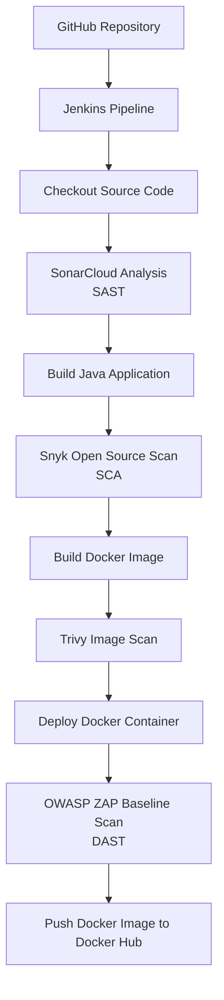

# SonarCloud SAST Setup
---

## Overview

This document describes how **SonarCloud** was integrated into the Jenkins CI/CD pipeline to perform **Static Application Security Testing (SAST)** for a Java application.

The complete DevSecOps pipeline consists of:

- **SAST** – SonarCloud
- **Software Composition Analysis (SCA)** – Snyk
- **Container Image Vulnerability Scanning** – Trivy
- **Dynamic Application Security Testing (DAST)** – OWASP ZAP Baseline Scan

SonarCloud performs automated static code analysis on every pipeline execution before the application is built and containerized, enabling security issues and code quality problems to be detected early in the software development lifecycle.

---

## Architecture Position

The AWS EC2 instance hosts the Jenkins server, which orchestrates the complete DevSecOps CI/CD pipeline. The pipeline retrieves source code from GitHub, performs multiple security scans throughout the software development lifecycle, builds and deploys the Dockerized application locally on the Jenkins EC2 instance, and finally publishes the Docker image to Docker Hub.



---

# Prerequisites

Before configuring SonarCloud, the following infrastructure had already been provisioned:

- AWS EC2 Ubuntu Server
- Jenkins
- Docker
- Java 17
- Java 21
- Maven
- Git
- Jenkins Pipeline
- Dockerfile
- GitHub repository containing the Java application

---

# Step 1 — Create a SonarCloud Account

Open your browser and navigate to:

> https://sonarcloud.io

Click:

- **Log in**
- **Continue with GitHub**

Authenticate using your GitHub account.

---

# Step 2 — Create a SonarCloud Access Token

After signing in:

Click

```
Account
```

↓

```
My Account
```

↓

```
Security
```

↓

```
Generate Token
```

Example:

| Field | Value |
|--------|-------|
| Token Name | Jefferson-token |

Click

```
Generate Token
```

Copy the generated token.

> **Important:** The token is displayed only once.

---

# Step 3 — Store the Token in Jenkins

Open Jenkins.

Navigate to

```
Manage Jenkins
```

↓

```
Credentials
```

↓

```
System
```

↓

```
Global Credentials
```

↓

```
Add Credentials
```

Configure the credential as follows:

| Field | Value |
|---------|----------------|
| Kind | Secret text |
| Scope | Global |
| Secret | SonarCloud Token |
| ID | SONAR_TOKEN |

Click **Create**.

---

# Step 4 — Create a SonarCloud Project

Inside SonarCloud:

Click

```
View All Organizations
```

Select your organization.

Click

```
+
```

↓

```
Create Project Manually
```

Example configuration:

| Setting | Value |
|-----------|-----------------------------|
| Organization | Jefferson-ohis1-org |
| Display Name | java-app |
| Project Key | JeffersonOhis1-org_java-app |
| Visibility | Private |

Click

```
Create Project
```

The generated **Project Key** will be used inside the Jenkins pipeline.

---

# Step 5 — Configure the Jenkins Pipeline

After checking out the source code, add a dedicated SonarCloud stage before building the application.

```groovy
stage('RunSonarCloudAnalysis') {
    steps {
        withCredentials([
            string(credentialsId: 'SONAR_TOKEN', variable: 'SONAR_TOKEN')
        ]) {

            sh '''
            mvn clean verify sonar:sonar \
              -Dsonar.login=$SONAR_TOKEN \
              -Dsonar.organization=jefferson-ohis1-org \
              -Dsonar.host.url=https://sonarcloud.io \
              -Dsonar.projectKey=jefferson-ohis1-org_java-apps
            '''
        }
    }
}
```
---

# Why `mvn clean verify sonar:sonar`?

The command performs multiple tasks in a single Maven execution.

| Command | Purpose |
|----------|----------|
| clean | Removes previous build artifacts |
| verify | Compiles, tests, and verifies the application |
| sonar:sonar | Uploads analysis results to SonarCloud |

Running SonarCloud immediately after source checkout allows security issues to be identified before packaging and containerization.

---

# Pipeline Placement

The SonarCloud stage was positioned immediately after source checkout.

```text
Checkout Code
        │
        ▼
Run SonarCloud Analysis
        │
        ▼
Build Java Application
```

This follows the **Shift Left Security** approach by identifying vulnerabilities early in the CI pipeline.

---

---

# Commit the Changes

After updating the Jenkinsfile:

```bash
git add .
```

```bash
git commit -m "Added SonarCloud SAST stage"
```

```bash
git push
```

---

# Trigger the Jenkins Build

Once the code is pushed to GitHub:

- GitHub Webhook automatically triggers Jenkins.
- Jenkins checks out the latest code.
- SonarCloud analysis begins.
- Results are uploaded to the SonarCloud dashboard.

---

# Verify Jenkins Execution

Open the Jenkins job.

Navigate to:

```
Build History
```

↓

```
Latest Build
```

↓

```
Console Output
```

A successful execution ends with:

```text
Finished: SUCCESS
```

---

# Verify the SonarCloud Report

Open SonarCloud.

Navigate to:

```
My Projects
```

↓

```
java-app
```
The dashboard displays analysis results including:

- Quality Gate
- Bugs
- Vulnerabilities
- Security Hotspots
- Code Smells
- Reliability Rating
- Security Rating
- Maintainability Rating
- Coverage
- Duplicated Code

A passing Quality Gate confirms that the project meets the configured quality and security thresholds.

---

# Security Benefits

Integrating SonarCloud into the CI/CD pipeline provides several advantages:
- Automated static application security testing
- Early detection of security vulnerabilities
- Identification of code quality issues
- Detection of code smells and bugs
- Continuous code inspection during every pipeline execution
- Supports Shift Left security practices
- Improves maintainability before deployment

---

# Pipeline Flow

```text
GitHub Push
      │
      ▼
Jenkins
      │
      ▼
Checkout Code
      │
      ▼
SonarCloud SAST
      │
      ▼
Build Java Application
      │
      ▼
Snyk SCA
      │
      ▼
Docker Build
      │
      ▼
Trivy Scan
      │
      ▼
Deploy Container
      │
      ▼
OWASP ZAP Scan
      │
      ▼
Push Docker Image
```

---

# Outcome

The SonarCloud integration successfully enabled automated **Static Application Security Testing (SAST)** within the Jenkins CI/CD pipeline. Every code commit triggers a security and quality analysis before the application is packaged, ensuring vulnerabilities and maintainability issues are detected early in the software development lifecycle as part of a complete DevSecOps workflow.