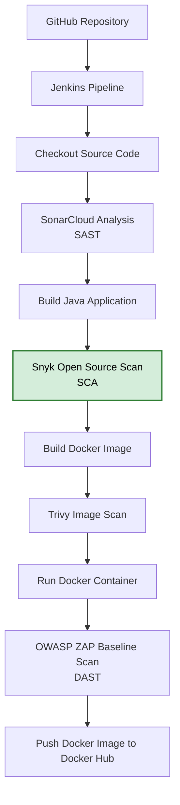

# Snyk Software Composition Analysis (SCA) Integration & Setup

---

## Overview

This document explains how Snyk Software Composition Analysis (SCA) was integrated into the Jenkins CI/CD pipeline to scan the Java application's Maven dependencies for known security vulnerabilities before building the Docker image.

The pipeline uses `snyk test` to identify vulnerable dependencies during the CI process and `snyk monitor` to upload a project snapshot to the Snyk platform for continuous dependency monitoring and vulnerability tracking.

---

## Security Stage Position

The Snyk scan runs after the Java application has been built and before the Docker image is created.

```text
Checkout Source Code
        │
        ▼
SonarCloud SAST Analysis
        │
        ▼
Build Java Application
        │
        ▼
Snyk Open Source (SCA)
        │
        ▼
Build Docker Image
        │
        ▼
Trivy Image Scan
        │
        ▼
Run Container
        │
        ▼
OWASP ZAP Baseline Scan
        │
        ▼
Push Docker Image
```

---

# Prerequisites

Before integrating Snyk, the following components were already configured:

- AWS Ubuntu EC2 instance
- Jenkins Server
- Docker
- Java 17 and Java 21
- Maven
- GitHub repository
- SonarCloud integration
- Existing Jenkins pipeline

---

# Step 1 — Create a Snyk Account

Open your browser and navigate to:

> https://snyk.io

Then:

1. Click **Sign Up**
2. Select **Continue with GitHub**
3. Authenticate with your GitHub account
4. Complete the registration process

---

# Step 2 — Generate a Snyk API Token

After logging in:

Click

```
Profile
    ↓
Account Settings
```

Under **General Settings**

Locate

```
Auth Token
```

Click

```
Show Key
```
Copy the generated API token.

This token will be used by Jenkins to authenticate with Snyk.

---

# Step 3 — Add the Token to Jenkins

Open Jenkins.

Navigate to

```
Manage Jenkins
    ↓
Credentials
    ↓
System
    ↓
Global credentials
    ↓
Add Credentials
```
Create a new Jenkins credential using the following configuration:

| Field | Value |
|-------|-------|
| **Kind** | Secret text |
| **Scope** | Global |
| **Secret** | Paste your Snyk API token |
| **ID** | `SNYK_TOKEN` |

After entering the required information, click **Create** to save the credential.

---

# Step 4 — Update the Jenkins Pipeline

Add a new stage immediately after the **Build Java Application** stage.

```groovy
stage('Snyk Scan') {

    tools {
        jdk 'jdk17'
        maven 'maven3'
    }

    environment {
        SNYK_TOKEN = credentials('SNYK_TOKEN')
    }

    steps {

        dir("${WORKSPACE}") {

            sh '''
                curl -Lo snyk https://static.snyk.io/cli/latest/snyk-linux

                chmod +x snyk
                chmod +x mvnw

                ./snyk auth --auth-type=token $SNYK_TOKEN

                ./mvnw dependency:tree -DoutputType=dot

                ./snyk test \
                    --all-projects \
                    --severity-threshold=medium \
                    --json-file-output=snyk-report.json || true

                ./snyk monitor \
                    --all-projects
            '''
        }
    }
}
```

---

# Step 5 — What Each Command Does

## Download the Latest Snyk CLI

```bash
curl -Lo snyk https://static.snyk.io/cli/latest/snyk-linux
```

Downloads the latest Linux version of the Snyk CLI during every pipeline run.

---

## Make the Executables Runnable

```bash
chmod +x snyk
chmod +x mvnw
```

Grants execute permission to:

- Snyk CLI
- Maven Wrapper

---

## Authenticate with Snyk

```bash
./snyk auth --auth-type=token $SNYK_TOKEN
```

Authenticates the CLI using the secret stored securely in Jenkins Credentials.

---

## Generate the Maven Dependency Graph

```bash
./mvnw dependency:tree -DoutputType=dot
```

Generates the dependency tree required by Snyk to accurately analyze all project dependencies.

---

## Scan All Maven Projects

```bash
./snyk test \
    --all-projects \
    --severity-threshold=medium \
    --json-file-output=snyk-report.json || true
```

This command:
- scans every Maven project
- identifies vulnerable dependencies
- reports Medium, High and Critical vulnerabilities
- exports the findings to `snyk-report.json`

The `|| true` prevents the Jenkins pipeline from failing during learning and demonstration purposes, allowing later stages to continue.

---

## Upload the Project Snapshot to Snyk

```bash
./snyk monitor \
    --all-projects
```

This command uploads a snapshot of the project's dependency state to the Snyk platform after the dependency scan completes.

Continuous monitoring enables:

- Project visibility in the Snyk dashboard
- Continuous dependency monitoring
- Automatic detection of newly disclosed vulnerabilities
- Dependency health tracking
- Remediation recommendations

---
# Why the Scan Runs After the Build Stage

The Java application is built before the Snyk scan because Maven resolves all project dependencies during the build process.

Running the scan afterward ensures Snyk analyzes the complete dependency graph rather than only the source code.

---

# Generated Report

The Snyk stage produces two outputs:

1.  Local Jenkins Artifact

snyk-report.json

This report contains:

- Vulnerable dependencies
- CVE information
- Severity levels
- Fixed versions (where available)
- Dependency paths
- Package metadata

2.  Snyk Dashboard

In addition to generating the JSON report, the pipeline uploads a dependency snapshot using `snyk monitor`.

The project appears in the Snyk dashboard, where you can review:

- Last scan time
- Dependency vulnerabilities
- Severity breakdown
- Dependency health
- Upgrade recommendations
- Continuous monitoring of newly disclosed vulnerabilities

---

# Archive the Report in Jenkins

The report is archived using the Jenkins post section.

```groovy
post {

    always {

        archiveArtifacts artifacts: 'snyk-report.json', fingerprint: true

    }

}
```
This makes the report downloadable from every Jenkins build.

---

# Running the Pipeline

Commit and push the updated Jenkinsfile.

```bash
git add .

git commit -m "Add Snyk Software Composition Analysis stage"

git push
```

The GitHub webhook automatically triggers the Jenkins pipeline.

---

# Verify the Build

In Jenkins:

```
java-app
    ↓
Build History
    ↓
Latest Build
    ↓
Console Output
```

Verify the following:

- Checkout completed successfully
- SonarCloud analysis completed
- Java application built successfully
- Snyk authentication succeeded
- Dependency scan completed
- snyk-report.json generated
- Project snapshot uploaded to Snyk
- Project appears in the Snyk dashboard
- Pipeline continued successfully

The build should finish with:

```
Finished: SUCCESS
```

---

# Security Benefits

Integrating Snyk into the CI/CD pipeline provides several advantages:

- Detects vulnerable open-source dependencies early
- Identifies known CVEs before deployment
- Integrates directly into Jenkins automation
- Generates machine-readable JSON reports
- Uploads project snapshots for continuous dependency monitoring
- Tracks newly disclosed vulnerabilities over time
- Provides dependency health and upgrade recommendations
- Strengthens the DevSecOps shift-left security approach

---

## Pipeline Position

The Snyk scan is integrated into the Jenkins pipeline after the Java application is built and before the Docker image is created. This placement ensures that third-party dependencies are analyzed for known vulnerabilities before the application is containerized.



## Implementation Outcome

The Jenkins pipeline now performs **Software Composition Analysis (SCA)** using **Snyk Open Source** during every pipeline execution.

Before the Docker image is built, Snyk scans all Maven dependencies for known security vulnerabilities. This shift-left security practice helps identify vulnerable third-party libraries early in the software delivery lifecycle, reducing the risk of packaging insecure dependencies into the application container.

The pipeline uses `snyk test` to generate a machine-readable security report (`snyk-report.json`), which is archived by Jenkins as a build artifact for later review and auditing.

After the scan completes, `snyk monitor` uploads a project snapshot to the Snyk platform. This enables continuous dependency monitoring, allowing newly disclosed vulnerabilities, dependency health, and remediation recommendations to be viewed through the Snyk dashboard.