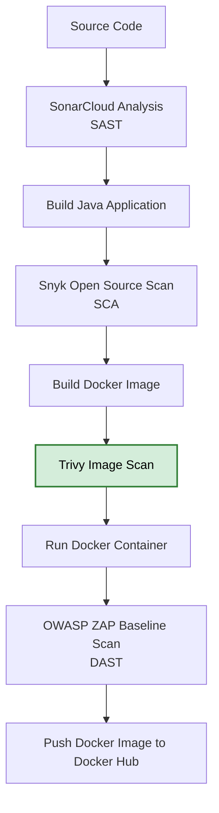
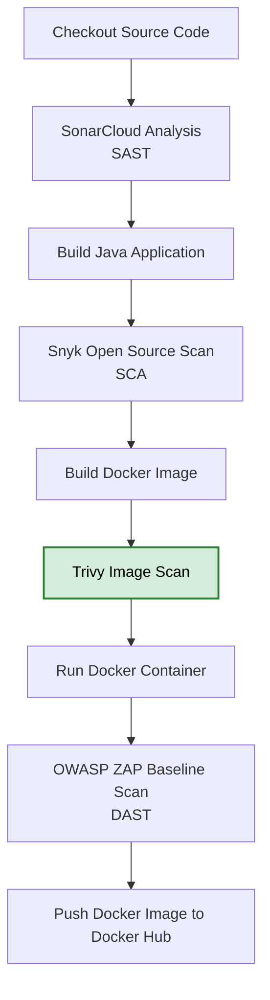

# Docker Image Vulnerability Scanning with Trivy

---

## Overview

This document describes how I integrated **Trivy** into my Jenkins CI/CD pipeline to perform **container image vulnerability scanning** before deploying a Dockerized Java application.

Trivy scans Docker images for known vulnerabilities in operating system packages and application dependencies, helping identify security risks before images are pushed to a container registry or deployed into production.

This security control forms part of my complete DevSecOps pipeline, which includes:

- Static Application Security Testing (SAST) using SonarCloud
- Software Composition Analysis (SCA) using Snyk
- **Container Image Vulnerability Scanning using Trivy**
- Dynamic Application Security Testing (DAST) using OWASP ZAP Baseline Scan

---

## Architecture Position

The Trivy image scan is integrated into the Jenkins pipeline immediately after the Docker image is built and before the application is deployed. This ensures that the container image is scanned for known vulnerabilities before it is executed, helping prevent vulnerable images from progressing further through the deployment process.



---

# Prerequisites

Before integrating Trivy into the pipeline, I provisioned an Ubuntu EC2 instance on AWS and configured it as my Jenkins server.

The server included:

- Ubuntu EC2 instance
- Jenkins
- Docker Engine
- Java 17
- Java 21
- Maven
- Git
- Trivy

Docker was configured so the Jenkins user could build and scan container images.

---

# Installing Trivy

Trivy was installed on the Jenkins server using Aqua Security's official APT repository.

Update the package index:

```bash
sudo apt update
```

Install required packages:

```bash
sudo apt-get install wget apt-transport-https gnupg lsb-release -y
```

Import the Trivy GPG key:

```bash
wget -qO - https://aquasecurity.github.io/trivy-repo/deb/public.key \
| gpg --dearmor \
| sudo tee /usr/share/keyrings/trivy.gpg > /dev/null
```

Add the Trivy repository:

```bash
echo "deb [signed-by=/usr/share/keyrings/trivy.gpg] https://aquasecurity.github.io/trivy-repo/deb $(lsb_release -sc) main" \
| sudo tee /etc/apt/sources.list.d/trivy.list
```

Install Trivy:

```bash
sudo apt-get update
sudo apt-get install trivy -y
```

Verify installation:

```bash
trivy --version
```

---

# Testing the Installation

To verify that Trivy was working correctly, I scanned the official Hello World Docker image.

Pull the image:

```bash
docker pull hello-world
```

Run a vulnerability scan:

```bash
trivy image hello-world
```

A successful scan confirmed that Trivy was correctly installed and ready for integration into Jenkins.

---

# Docker Image Build Stage

After successfully building the Java application, Jenkins builds the Docker image.

```groovy
stage('Build Docker Image') {
    steps {
        script {
            env.IMAGE_TAG = "v${BUILD_NUMBER}"
        }

        sh '''
            docker build -t ${IMAGE_NAME}:${IMAGE_TAG} .
            docker tag ${IMAGE_NAME}:${IMAGE_TAG} ${IMAGE_NAME}:latest
        '''
    }
}
```

This stage creates:

- Versioned image
- Latest image tag

Example:

```
jeffersonohis1/my-java-app:v12
jeffersonohis1/my-java-app:latest
```

---

# Trivy Scan Stage

Immediately after the Docker image is built, Jenkins executes the Trivy scan.

```groovy
stage('Trivy Image Scan') {
    steps {
        sh '''
            trivy image \
                --scanners vuln \
                --severity HIGH,CRITICAL \
                --ignore-unfixed \
                --exit-code 0 \
                --no-progress \
                --format table \
                -o trivy-report.txt \
                ${IMAGE_NAME}:${IMAGE_TAG}
        '''
    }
}
```

---

## Trivy Scan Options

The following command-line options were used to customize the Trivy image scan performed by the Jenkins pipeline. These settings focus the scan on actionable vulnerabilities while producing a clean, human-readable report that is archived as a Jenkins build artifact.

| Option | Description |
|---------|-------------|
| `--scanners vuln` | Performs vulnerability scanning only, excluding other scan types such as misconfiguration or secrets. |
| `--severity HIGH,CRITICAL` | Reports only **High** and **Critical** severity vulnerabilities to focus on the most significant security risks. |
| `--ignore-unfixed` | Excludes vulnerabilities that currently have no available fix, reducing noise in the report. |
| `--exit-code 0` | Prevents the Jenkins pipeline from failing when vulnerabilities are detected, allowing the scan report to be generated for review. |
| `--no-progress` | Disables the progress bar, producing cleaner Jenkins console output. |
| `--format table` | Formats the scan results as a human-readable table. |
| `-o trivy-report.txt` | Writes the scan results to `trivy-report.txt`, which is archived as a Jenkins build artifact. |

> **Note:** For this portfolio project, `--exit-code 0` was intentionally used so that the pipeline completes successfully while still producing a vulnerability report for analysis. In a production environment, organizations often configure Trivy to fail the pipeline when vulnerabilities above a defined severity threshold are detected.

---

## Generated Report

Trivy generates a report named:

```
trivy-report.txt
```

The report includes information such as:

- Detected vulnerabilities
- Package names
- Installed versions
- Fixed versions (when available)
- Severity levels
- CVE identifiers

This report is archived by Jenkins after every pipeline execution.

---

# Jenkins Artifact Archiving

The Trivy report is stored as a Jenkins build artifact.

```groovy
post {
    always {
        archiveArtifacts artifacts: 'trivy-report.txt, zap-report.html, snyk-report.json',
        fingerprint: true
    }
}
```

This allows each pipeline execution to retain its security scan results for later review.

---

## Pipeline Position

The **Trivy Image Scan** stage is executed immediately after the Docker image is built and before the container is deployed. This placement ensures that the container image is scanned for known vulnerabilities before it is executed or published to Docker Hub.



### Why Trivy Runs at This Stage

Scanning the Docker image before deployment provides an additional security gate within the CI/CD pipeline. By analyzing the container image immediately after it is built, vulnerabilities in the operating system packages and application dependencies can be identified before the container is started or the image is pushed to Docker Hub.

This shift-left approach helps ensure that only reviewed container images progress to deployment and distribution, reducing the likelihood of introducing vulnerable images into downstream environments.

---

## Benefits of Integrating Trivy

Integrating **Trivy** into the CI/CD pipeline enhances container security by automatically scanning Docker images for known vulnerabilities before deployment. By performing the scan immediately after the Docker image is built, security issues can be identified and reviewed before the application is executed or the image is published.

Key benefits include:

- Detects known vulnerabilities in operating system packages included in the container image.
- Identifies vulnerable application dependencies packaged within the container.
- Integrates seamlessly into Jenkins pipelines for automated container security scanning.
- Produces detailed, human-readable vulnerability reports for security analysis and auditing.
- Supports policy enforcement through configurable exit codes, allowing organizations to define acceptable security thresholds.
- Encourages shift-left security by identifying container vulnerabilities early in the software delivery lifecycle.
- Improves the overall security posture of containerized applications through automated vulnerability assessment.

## Implementation Outcome

The Trivy integration was successfully incorporated into the Jenkins pipeline to automatically scan every Docker image after it is built and before the application is deployed.

For this project, the scan is configured to:

- Focus on **High** and **Critical** severity vulnerabilities.
- Ignore vulnerabilities that do not currently have available fixes.
- Generate a human-readable report (`trivy-report.txt`) for review.
- Archive the report as a Jenkins build artifact.
- Allow the pipeline to continue (`--exit-code 0`) so that the remaining DevSecOps stages can execute for demonstration purposes.

This implementation demonstrates how container image security can be integrated into a complete DevSecOps CI/CD pipeline alongside:

- **SonarCloud** for Static Application Security Testing (SAST)
- **Snyk Open Source** for Software Composition Analysis (SCA)
- **Trivy** for container image vulnerability scanning
- **OWASP ZAP Baseline Scan** for Dynamic Application Security Testing (DAST)