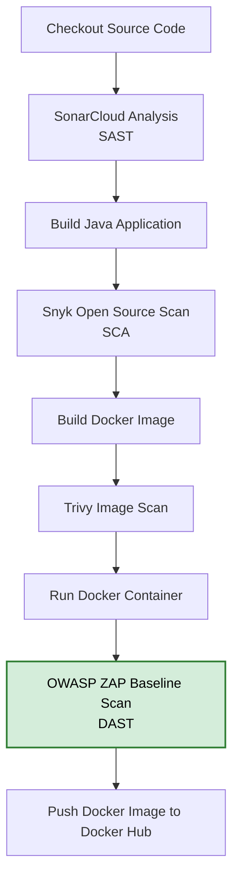

# OWASP ZAP Baseline DAST Scan

## Overview

This document describes how I integrated **Dynamic Application Security Testing (DAST)** into my DevSecOps CI/CD pipeline using **OWASP ZAP Baseline Scan**.

Unlike SAST and SCA, which analyze source code and dependencies before deployment, DAST tests a **running application** by interacting with it over HTTP. This approach helps identify security issues that are only visible during runtime.

The **OWASP ZAP Baseline Scan** was selected because it performs passive security testing against a running web application without modifying application state. This makes it well suited for automated CI/CD pipelines, where fast security validation is preferred over comprehensive active penetration testing.

In this project, the application is first built, containerized, scanned with Trivy, deployed as a Docker container on an AWS EC2 Jenkins server, and finally scanned using the OWASP ZAP Baseline Scan.

The scan is executed after the application is deployed to a Docker container and passes a basic health check. This allows the pipeline to identify common web application security issues before the Docker image is published to Docker Hub.

---

# Security Workflow

The complete security pipeline follows a shift-left approach:

1. Source Code Checkout
2. SonarCloud Static Application Security Testing (SAST)
3. Maven Build
4. Snyk Software Composition Analysis (SCA)
5. Docker Image Build
6. Trivy Container Image Scan
7. Deploy Docker Container
8. Wait for Application Startup
9. **OWASP ZAP Baseline Scan (DAST)**
10. Push Docker Image to Docker Hub

---

# Prerequisites

Before integrating OWASP ZAP into the pipeline, I completed the following setup:

- Created an Ubuntu EC2 instance on AWS
- Installed:
  - Jenkins
  - Docker
  - Java 17
  - Java 21
  - Maven
  - Trivy
- Configured Jenkins
- Configured Docker Hub credentials
- Configured SonarCloud credentials
- Configured Snyk credentials
- Created the Dockerfile
- Created the Jenkins Pipeline

---

## AWS EC2 Configuration

The OWASP ZAP Baseline Scan was executed from a Jenkins server hosted on an Ubuntu EC2 instance in AWS. The Jenkins pipeline, Docker container, and OWASP ZAP scan all ran on this instance. The server was provisioned with the following configuration.

| Setting | Value |
|----------|-------|
| **Instance Name** | Jenkins-server |
| **Operating System (AMI)** | Ubuntu Server |
| **Instance Type** | t2.medium (4 GB RAM) |
| **Public IP** | Enabled |
| **Security Group** | Existing Security Group |


### Security Group Inbound Rules

| Port | Protocol | Purpose |
|------|----------|---------|
| **22** | SSH | Remote administration of the EC2 instance |
| **80** | HTTP | Standard web traffic |
| **8080** | TCP | Jenkins web interface |
| **8081** | TCP | Access to the Dockerized Java application |

> **Note:** For detailed infrastructure provisioning and Jenkins configuration steps, including plugin installation, global tool configuration, and credential management, see [AWS EC2 & Jenkins Server Setup](01-aws-jenkins-setup.md).

---

# Containerizing the Spring Boot Application

A multi-stage Dockerfile was created to build and package the Spring Boot application.

```dockerfile
FROM maven:3.8.4-openjdk-17-slim AS build

WORKDIR /app

COPY . .

RUN mvn clean package

FROM eclipse-temurin:17-jdk-jammy

WORKDIR /app

COPY --from=build /app/target/*.jar app.jar

EXPOSE 8081

ENTRYPOINT ["java","-jar","app.jar"]
```
---

# Running the Docker Container

Before running the DAST scan, the application must be deployed.

The Jenkins pipeline starts the container using:

```groovy
stage('Run Container') {
    steps {
        sh '''
        docker rm -f devsecops-java-app-container || true

        docker run -d \
            --name devsecops-java-app-container \
            -p 8081:8081 \
            ${IMAGE_NAME}:${IMAGE_TAG}
        '''
    }
}
```
---

# Waiting for the Application

The pipeline waits until the application becomes available.

```groovy
stage('Wait for Application') {
    steps {
        sh '''
            until curl -fs http://localhost:8081/ > /dev/null
            do
                sleep 5
            done
        '''
    }
}
```

**This prevents OWASP ZAP from starting before the application is fully running.**

---

## Why OWASP ZAP Baseline Scan?

The OWASP ZAP Baseline Scan was selected because it performs passive security testing against a running web application without modifying application state. Unlike the full OWASP ZAP scan, it analyzes HTTP traffic without launching active attacks against the application, making it well suited for automated CI/CD pipelines where fast, non-intrusive security validation is preferred.

---

## OWASP ZAP Baseline Integration

OWASP ZAP was executed using the official Docker image during the Jenkins pipeline. Before the scan, the pipeline deploys the Java application as a Docker container and waits until the application is available on port **8081**.

The ZAP Baseline Scan is then executed against the running application.

```groovy
stage('OWASP ZAP Baseline Scan') {
    steps {
        script {

            def status = sh(
                script: '''
                    docker run --rm \
                        --network host \
                        -v $(pwd):/zap/wrk/:rw \
                        ghcr.io/zaproxy/zaproxy:stable \
                        zap-baseline.py \
                        -t http://localhost:8081 \
                        -r zap-report.html
                ''',
                returnStatus: true
            )

            echo "ZAP exited with code ${status}"

            switch(status){
                
                case 0:
                    echo "No security issues detected."
                    break

                case 1:
                    echo "FAIL-level security issues found."
                    break

                case 2:
                    echo "Warnings detected."
                    break

                case 3:
                    echo "ZAP scan failed."
                    currentBuild.result='UNSTABLE'
                    break

                default:
                    error("Unexpected exit code")
            }
        }
    }
}
```

### ZAP Command Explanation

| Option | Description |
|---------|-------------|
| `docker run --rm` | Runs the ZAP container and removes it after completion. |
| `--network host` | Allows the ZAP container to access the application running on the Jenkins EC2 host. |
| `-v $(pwd):/zap/wrk/:rw` | Mounts the Jenkins workspace so the generated report can be saved. |
| `ghcr.io/zaproxy/zaproxy:stable` | Uses the official OWASP ZAP Docker image. |
| `zap-baseline.py` | Executes the OWASP ZAP Baseline Scan. |
| `-t http://localhost:8081` | Specifies the target application running inside the Docker container. |
| `-r zap-report.html` | Generates the HTML security report. |


**Why `--network host`?**
The Docker container running OWASP ZAP uses:

```bash
--network host
```

This allows the ZAP container to share the Jenkins server's network namespace.

As a result,

```
http://localhost:8081
```

inside the ZAP container points directly to the Spring Boot application running on the Jenkins EC2 host.

Without host networking, the ZAP container would not be able to access the application using `localhost`.

---

# Understanding ZAP Exit Codes

The pipeline captures the exit code returned by the ZAP Baseline Scan.

| Exit Code | Description | Jenkins Pipeline Action |
| :-------: | ----------- | ----------------------- |
| **0** | No security issues detected. | Continue the pipeline. |
| **1** | One or more **FAIL-level** security issues were detected. | Log the findings and review the generated `zap-report.html`. |
| **2** | One or more **WARNING-level** security issues were detected. | Log the findings and review the generated `zap-report.html`. |
| **3** | The OWASP ZAP scan did not complete successfully. | Mark the build as **UNSTABLE** and investigate the scan failure. |

**Instead of immediately failing the pipeline, the result is logged so the generated report can be reviewed.**

---
# Archiving Security Reports

After the pipeline finishes, Jenkins archives all generated reports.

```groovy
post {
    always {

        sh 'docker rm -f devsecops-java-app-container || true'

        archiveArtifacts artifacts: 'trivy-report.txt, zap-report.html, snyk-report.json',
        fingerprint: true
    }
}
```

### Reports archived:

| Report | Description |
| :----- | :---------- |
| `snyk-report.json` | JSON report containing Software Composition Analysis (SCA) results for project dependencies. |
| `trivy-report.txt` | Text report containing Docker image vulnerability scan results from Trivy. |
| `zap-report.html` | HTML report generated by the OWASP ZAP Baseline Scan, containing Dynamic Application Security Testing (DAST) findings, alerts, and recommendations. |

### OWASP ZAP Report Contents

The generated `zap-report.html` includes:

- Scan Overview
- Alerts
- Risk Summary
- Security Findings
- Affected URLs
- Risk Levels (High, Medium, Low, Informational)
- Recommendations

**The report is archived automatically as a Jenkins build artifact.**

---

## Jenkins Pipeline Flow

The OWASP ZAP Baseline Scan is executed after the application has been deployed and verified to be running successfully.


---

## Results

The OWASP ZAP Baseline Scan successfully analyzed the deployed Spring Boot application running inside a Docker container. The scan completed automatically as part of the Jenkins pipeline and produced an HTML report containing detected alerts, risk classifications, affected endpoints, and recommended remediation guidance.

The report provides visibility into potential web application security issues while allowing the pipeline to continue executing. The Jenkins pipeline interprets the ZAP exit status to distinguish between successful scans, warning-level findings, fail-level findings, and scan failures, enabling security results to be reviewed without interrupting the CI/CD workflow.

---

## Benefits

Integrating OWASP ZAP into the CI/CD pipeline provides several advantages:

- Performs automated Dynamic Application Security Testing (DAST).
- Scans the running web application rather than source code or container images.
- Detects common web application security issues before the container image is published to Docker Hub.
- Generates detailed HTML security reports for review.
- Integrates seamlessly into Jenkins using the official OWASP ZAP Docker image.
- Supports continuous security validation as part of the DevSecOps workflow.

---

## Implementation Outcome

By successfully integrating the **OWASP ZAP Baseline Scan** into the Jenkins pipeline, the application is automatically tested in a live runtime environment after deployment. Combined with SonarCloud (SAST), Snyk Open Source (SCA), and Trivy (Container Image Vulnerability Scanning), the pipeline implemented a layered DevSecOps security strategy that validates source code quality, third-party dependencies, container images, and the deployed application before the container image is published to Docker Hub.
