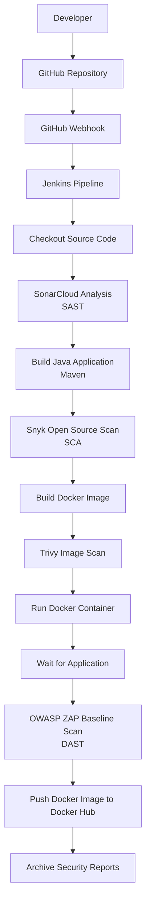
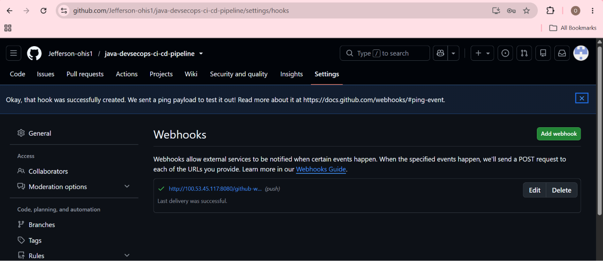
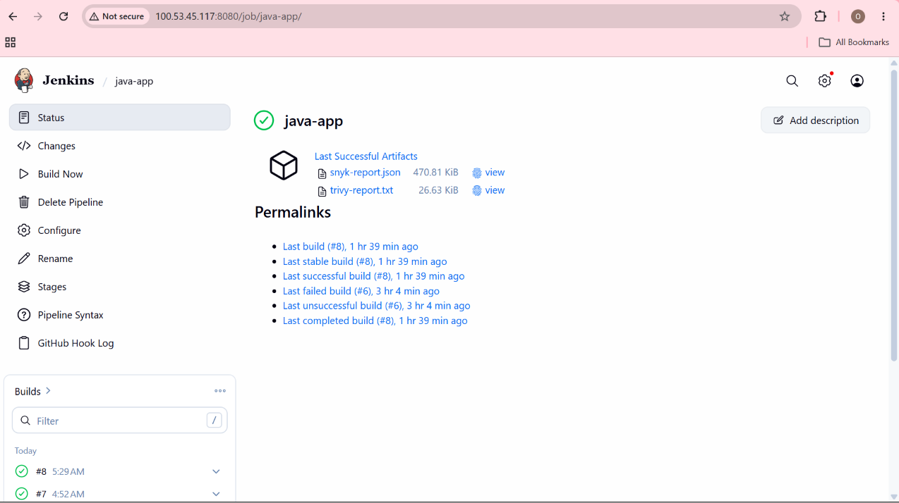
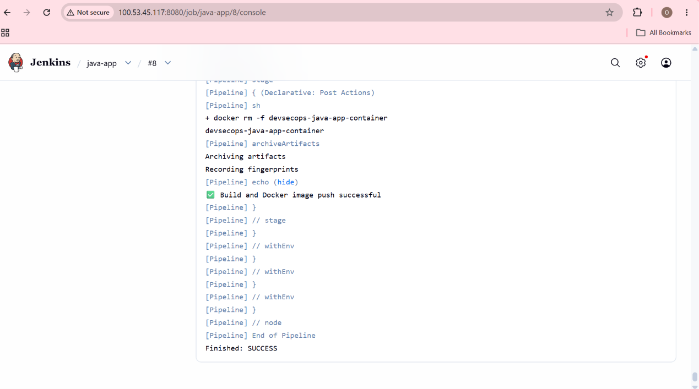
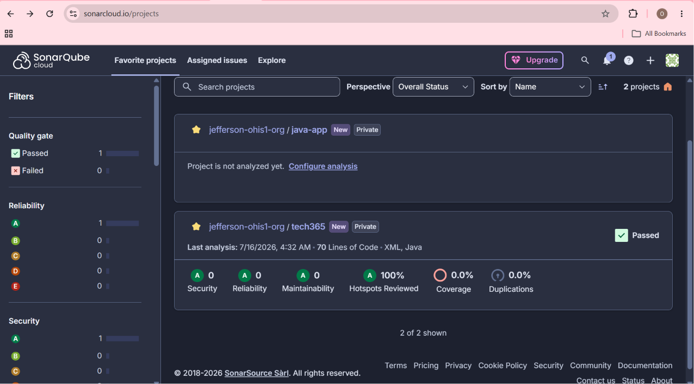
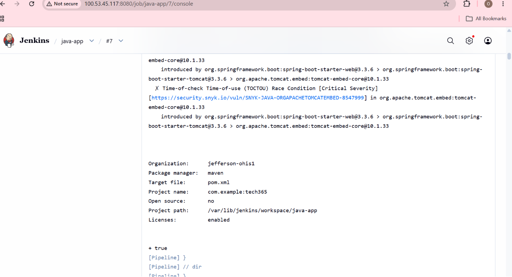
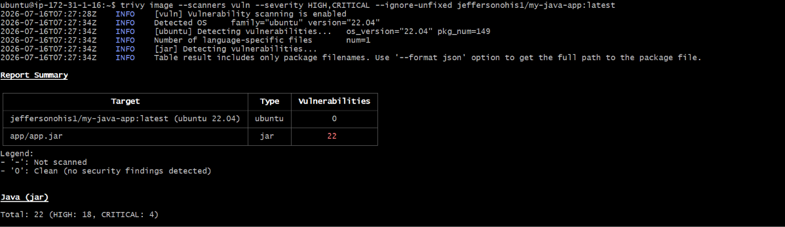
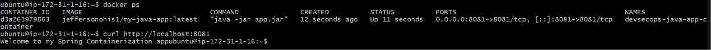
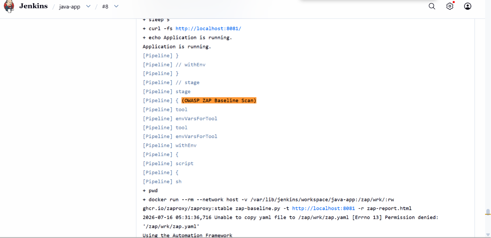
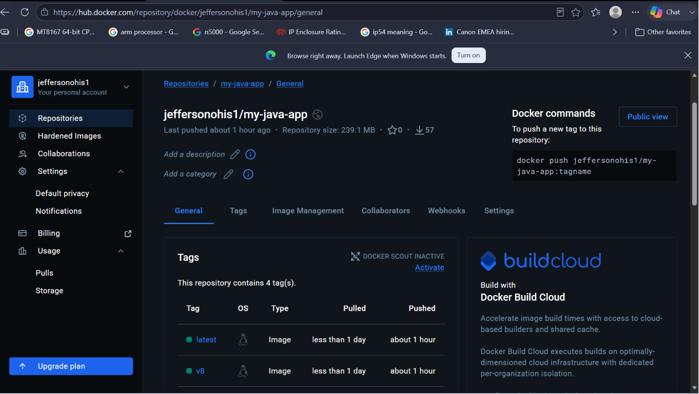

# Jenkins DevSecOps Pipeline Walkthrough

## Overview

This document explains the complete Jenkins Declarative Pipeline used to automate the build, security testing, containerization, deployment, and delivery of a Java application.

The pipeline follows a DevSecOps Shift-Left approach by integrating security scans throughout the software delivery lifecycle instead of performing security checks only after deployment.

The pipeline includes:
- Source Code Checkout
- Static Application Security Testing (SAST) using SonarCloud
- Maven Build
- Software Composition Analysis (SCA) using Snyk
- Docker Image Build
- Docker Image Vulnerability Scan using Trivy
- Container Deployment
- Dynamic Application Security Testing (DAST) using OWASP ZAP Baseline Scan
- Docker Image Push to Docker Hub
- Report Archiving and Cleanup

---

## Architecture



---

## Prerequisites

Before running the pipeline, the Jenkins server was provisioned on an Ubuntu EC2 instance with the following components installed:
- Jenkins
- Java JDK 17
- Java JDK 21
- Maven
- Docker
- Trivy

### The Jenkins server was configured with:

- Docker credentials
- SonarCloud token
- Snyk authentication token

### Detailed installation steps are available in:

- 01-aws-jenkins-setup.md
- 02-sonarcloud-sast.md
- 03-snyk-scan-setup.md
- 04-trivy-container-security.md
- 05-owasp-zap-baseline-dast-scan.md

---

## Pipeline Workflow

### 1. Checkout Code

**stage('Checkout Code')**

The pipeline begins by checking out the latest version of the application source code from the  configured GitHub repository.

This ensures every pipeline execution works with the most recent commit.

### 2. SonarCloud Static Code Analysis (SAST)

**stage('RunSonarCloudAnalysis')**

After the source code is checked out, Jenkins performs Static Application Security Testing using SonarCloud.

The pipeline authenticates using the stored SonarCloud token before executing:

```bash
mvn clean verify sonar:sonar
```

This stage analyzes the Java source code for:
- Bugs
- Code smells
- Security vulnerabilities
- Security hotspots
- Maintainability
- Reliability
- Code duplication
- Quality Gate status

Running the scan before building the Docker image helps detect coding issues early in the pipeline.

### 3. Build Java Application

**stage('Build Java Application')**

The Java application is compiled and packaged using Maven.

```bash
mvn clean package
```

**The build generates the executable JAR file that will later be containerized.**

### 4. Snyk Software Composition Analysis (SCA)

**stage('Snyk Scan')**

After the Maven build completes, Jenkins scans the application's open-source dependencies using Snyk.

#### The pipeline:
- Downloads the Snyk CLI
- Authenticates using the Jenkins credential
- Generates the Maven dependency tree
- Scans all project dependencies

#### The scan performs Software Composition Analysis (SCA) to identify:
- Vulnerable third-party libraries
- Known CVEs
- Outdated dependencies/Recommended dependency upgrades

#### Output:
- snyk-report.json

**Using SCA after the Maven build ensures the dependency graph is complete before analysis.**

### 5. Build Docker Image

**stage('Build Docker Image')**

Once the application passes dependency scanning, Jenkins builds the Docker image.

Each build receives:
- a version tag (vBUILD_NUMBER)
- a latest tag

This stage packages the application into a portable container ready for deployment.

### 6. Trivy Docker Image Scan

**stage('Trivy Image Scan')**

After the Docker image is created, Trivy scans it for operating system and package vulnerabilities.

The scan checks for:
- High vulnerabilities
- Critical vulnerabilities
- Operating system package vulnerabilities
- Application package vulnerabilities

The scan generates:
- trivy-report.txt

**Only HIGH and CRITICAL vulnerabilities are reported.**

Scanning the container image before deployment helps identify vulnerabilities introduced through the operating system or installed packages.

### 7. Run Docker Container

**stage('Run Container')**

The pipeline removes any previous container before launching the newly built image.

After the image passes the vulnerability scan, Jenkins starts a Docker container.

Port Mapping: 
- 8081 → 8081

The container exposes: 8081

This deploys the application locally on the Jenkins server for runtime testing and the deployed application becomes the target for Dynamic Application Security Testing.

### 8. Wait for Application Startup

**stage('Wait for Application')**

Before performing runtime security testing using OWASP ZAP, Jenkins verifies that the application is fully started.

The pipeline repeatedly checks:

```bash
curl http://localhost:8081
```

Once the application responds successfully, the pipeline proceeds to the DAST stage.

### 9. OWASP ZAP Baseline Scan (DAST)

**stage('OWASP ZAP Baseline Scan')**

Jenkins launches the OWASP ZAP Docker container to perform a Baseline Scan against the running application.

The container performs a Baseline Scan against:
- http://localhost:8081

Unlike a Full Scan, the Baseline Scan performs passive security analysis without attacking the application, making it suitable for CI/CD pipelines.

The scan produces:
- zap-report.html

The generated report includes:
- Scan Overview
- Alerts
- Risk Summary
- Security Findings

The pipeline also evaluates the ZAP exit code to determine whether:
- No issues were found
- Warnings were detected
- Fail-level alerts were identified
- The scan encountered an error

### 10. Push Docker Image

**stage('Push Docker Image')**

After all security checks complete, Jenkins authenticates with Docker Hub using stored credentials.

The pipeline pushes:
- Version-tagged image
- Latest image

**This ensures only images that have completed the security pipeline are published. This makes the validated container image available for deployment.**

### 11. Archive Security Reports

At the end of every pipeline execution, Jenkins pipeline automatically generates and archives the following security reports during each build as artifacts.

| Report | Description |
|--------|-------------|
| `snyk-report.json` | JSON report containing **Software Composition Analysis (SCA)** results for the project's Maven dependencies. |
| `trivy-report.txt` | Text report containing **container image vulnerability scan** results generated by Trivy. |
| `zap-report.html` | HTML report containing **Dynamic Application Security Testing (DAST)** results generated by the OWASP ZAP Baseline Scan. |

> **Note:** These reports are archived as Jenkins build artifacts, making them available for download and review after each pipeline execution. These reports can be downloaded from the Jenkins build page for later review.

---

## Post Actions

Regardless of pipeline success or failure, Jenkins performs cleanup tasks.

### Container Cleanup

The running container is removed.

```bash
docker rm -f devsecops-java-app-container
```

This prevents leftover containers from consuming server resources.

---

## Pipeline Security Flow

The completed Jenkins pipeline incorporates multiple security controls at different stages of the software delivery lifecycle. Each security tool addresses a specific layer of the application stack, providing comprehensive security validation before the Docker image is published.

| Pipeline Stage | Security Practice | Purpose |
|---------------|-------------------|---------|
| **SonarCloud** | Static Application Security Testing (SAST) | Analyzes the application source code for code quality issues, bugs, vulnerabilities, and security hotspots before the application is built. |
| **Snyk Open Source** | Software Composition Analysis (SCA) | Scans Maven dependencies for known vulnerabilities in third-party open-source libraries. |
| **Trivy** | Container Image Vulnerability Scanning | Scans the built Docker image for known vulnerabilities in operating system packages and packaged application dependencies. |
| **OWASP ZAP Baseline Scan** | Dynamic Application Security Testing (DAST) | Tests the running Dockerized application for common web application security issues after deployment. |

### Security Strategy

By integrating multiple security controls into the CI/CD pipeline, security is applied throughout the software delivery lifecycle rather than being performed only at the end of development.

This layered DevSecOps approach enables:

- Early detection of source code vulnerabilities through **SAST**.
- Identification of vulnerable third-party dependencies using **SCA**.
- Validation of container image security before deployment.
- Runtime security testing of the deployed application using **DAST**.
- Automated generation and archival of security reports for review and auditing.

Together, these stages provide continuous security validation from source code commit through application deployment, demonstrating a practical implementation of **shift-left security** within a DevSecOps CI/CD pipeline.

---
## Pipeline Benefits

This pipeline provides several DevSecOps benefits:
- Automates software build and deployment.
- Integrates security testing throughout the CI/CD pipeline.
- Detects vulnerabilities early in the software development lifecycle.
- Scans application source code, dependencies, Docker images, and the running application.
- Generates downloadable security reports for auditing and review.
- Publishes validated Docker images to Docker Hub only after successful pipeline execution.

---

## Screenshots

**Figure 1. GitHub Webhook Configuration Success**



---

**Figure 2. Jenkins Pipeline Dashboard**


---

**Figure 3. Jenkins Build History**



---

**Figure 4. Jenkins Console Output – Successful Pipeline Execution**



---

**Figure 5. sonarcloud-quality-gate**



---

**Figure 6. snyk-scan-execution**



---

**Figure 7. Trivy Image Scan vulnerability summary**



---

**Figure 8. Running-Docker-Container**



---

**Figure 9. OWASP-Zap-Scan-Execution**



---

**Figure 10. Jenkins Archived Artifacts – snyk-report.json, trivy-report.txt, and zap-report.html**


---

**Figure 13. Dockerhub-Published-Image**



---

## Conclusion

This Jenkins Declarative Pipeline demonstrates a complete DevSecOps implementation by integrating security into every major stage of the CI/CD workflow. Instead of treating security as a final step, the pipeline continuously validates source code, third-party dependencies, container images, and the running application before publishing Docker images. The result is an automated, repeatable, and security-focused delivery pipeline that aligns with modern DevSecOps best practices.
