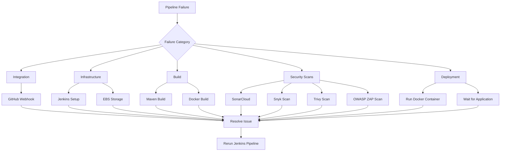

# Troubleshooting Guide

## Overview

This guide documents common issues encountered while building a complete DevSecOps CI/CD pipeline for a Java application using:

- Jenkins
- Docker
- AWS EC2 (Ubuntu)
- SonarCloud (SAST)
- Snyk (Software Composition Analysis)
- Trivy (Docker Image Vulnerability Scanning)
- OWASP ZAP Baseline Scan (DAST)

Each section includes the symptoms, possible causes, and the solution used during implementation.

---

## Table of Contents

1. Unable to Connect to Jenkins Web Interface
2. Jenkins Initial Administrator Password Not Found
3. Jenkins Cannot Execute Docker Commands
4. Docker Service Not Running
5. Java Version Mismatch
6. Maven Build Failure
7. SonarCloud Authentication Failure
8. SonarCloud Project Not Found
9. Snyk Authentication Failed
10. Snyk Dependency Scan Failed
11. Snyk Scan Failed the Pipeline
12. Docker Image Build Failed
13. Insufficient Amazon EBS Disk Space During Docker Build
14. Docker Image Push Failed
15. Trivy Command Not Found
16. Trivy Scan Failed the Build
17. Application Deployment and OWASP ZAP Failed
18. Jenkins Build Reports Missing
19. GitHub Webhook Did Not Trigger Jenkins
20. Docker Container Already Exists
21. Pipeline Behavior
22. Summary
23. Conclusion
24. Lessons Learned

---

## Quick Reference

The table below provides a quick overview of the most common issues encountered during the implementation of the DevSecOps CI/CD pipeline and the corresponding actions to resolve them. Refer to the relevant troubleshooting section for detailed diagnostics and step-by-step solutions.

| **Component** | **Common Issue** | **Quick Fix** |
|---------------|------------------|---------------|
| **Jenkins** | Service won't start | Check `sudo systemctl status jenkins`. |
| **Docker** | Permission denied | Add the `jenkins` user to the Docker group. |
| **Amazon EBS** | Insufficient disk space during Docker builds | Increase the root EBS volume and expand the Linux partition and filesystem. |
| **Maven** | Build failure | Verify JDK 17 and Maven configuration. |
| **SonarCloud** | Authentication failed | Configure `SONAR_TOKEN`. |
| **SonarCloud** | Project not found | Verify the organization and project key. |
| **Snyk** | Authentication failed | Configure `SNYK_TOKEN`. |
| **Trivy** | Command not found | Install Trivy and verify `trivy --version`. |
| **OWASP ZAP** | Cannot connect | Wait for the application and use `--network host`. |
| **Docker Hub** | Image push failed | Verify Docker Hub credentials and repository. |
| **GitHub Webhook** | Pipeline not triggered | Verify the webhook URL and TCP port **8080**. |

> [!TIP]
> This table is intended as a quick troubleshooting index. Each issue is explained in detail later in this guide, including possible causes, diagnostic commands, and complete resolutions.
---

## Troubleshooting Workflow



---
## 1. Unable to Connect to Jenkins Web Interface

### Problem

After installing Jenkins, the service failed to start.

- Opening: http://<EC2-Public-IP>:8080

**does not load the Jenkins setup page.**

### Possible Causes
- Jenkins service is not running.
- Port 8080 is blocked.
- Security Group does not allow inbound traffic.
- EC2 instance is not running.

### Solution

- Verify Jenkins service.
```bash
sudo systemctl status jenkins
```
- Start Jenkins if necessary.
```bash
sudo systemctl start jenkins
```

## Verify the EC2 Network Configuration
Before accessing Jenkins or running the pipeline, verify that the EC2 instance is running and that the required inbound security group rules are configured.

### Required Security Group Inbound Rules

| Port | Protocol | Purpose |
|------|----------|---------|
| **22** | SSH | Remote administration of the EC2 instance |
| **80** | HTTP | Standard web traffic |
| **8080** | TCP | Jenkins web interface |
| **8081** | TCP | Access to the Dockerized Java application |

> [!IMPORTANT] Confirm that the EC2 instance is in the **Running** state and access Jenkins using the instance's **Public IPv4 address**.
>
> Example:
>
> ```text
> http://<EC2-PUBLIC-IP>:8080
> ```

**Figure: Jenkins Dashboard**


---

## 2. Jenkins Initial Administrator Password Not Found

### Problem

- Unable to unlock Jenkins because the administrator password cannot be located.

### Solution

- Retrieve the password using:

```bash
sudo cat /var/lib/jenkins/secrets/initialAdminPassword
```

**Copy the output and paste it into the Jenkins Unlock page.**

---

## 3. Jenkins Cannot Execute Docker Commands

### Problem

- Pipeline failed with Docker permission errors.

**error: permission denied while trying to connect to the Docker daemon.**


### Cause
- The Jenkins user was not added to the Docker group.

### Resolution
- Added the Jenkins user to the Docker group.

```bash
sudo usermod -aG docker jenkins
```

- Restarted Jenkins.

```bash
sudo systemctl restart jenkins
```

-Verified Docker access.

```bash
sudo -u jenkins docker version
```

---

## 4. Docker Service Not Running

### Problem

- Docker commands fail.

**error: Cannot connect to the Docker daemon.**

### Solution

- Start Docker

```bash
sudo systemctl start docker
```

- Enable Docker to start automatically.
```bash
sudo systemctl enable docker
```

- Verify Docker.

```bash
docker --version
```

---

## 5. Jenkins Build Failed Due to Java Version Mismatch

### Problem

- The pipeline failed during the Maven build because Jenkins was using Java 21 while the application required Java 17.

### Cause

The Java application was developed using JDK 17, but Jenkins server was configured with a JDK 21 version.

### Solution

- Install JDK 17 in Jenkins server.

```bash
sudo apt update
sudo apt install -y openjdk-17-jdk
```

- Verify installation.

```bash
ls /usr/lib/jvm/
```

- Restart Jenkins.

```bash
sudo systemctl restart jenkins
```

### Configure Jenkins:

Manage Jenkins → Tools

Name:
jdk17

JAVA_HOME:
/usr/lib/jvm/java-17-openjdk-amd64

Install automatically:
Unchecked

Update the Jenkinsfile.

```groovy
tools {
    jdk 'jdk17'
    maven 'maven3'
}
```

**After configuring the correct JDK, the pipeline completed successfully.**

---

## 6. Maven Build Failure

### Problem

- The Java application failed during compilation.

### Possible Causes
- Wrong Java version
- Missing Maven installation
- Dependency download failure

### Solution

- Verify Java:

```bash
java --version
```

- Verify Maven:

```bash
mvn --version
```

- Confirm Jenkins is using:
- JDK 17
- Maven 3

---

## 7. SonarCloud Authentication Failure

### Problem

-The SonarCloud analysis stage failed with an authentication error.

### Cause

- The SonarCloud access token was incorrectly configured in Jenkins.

### Solution

- Generate a new SonarCloud access token.

- Store it in Jenkins:

Kind:
Secret Text

ID:
SONAR_TOKEN

Reference the credential in the Jenkinsfile.

```groovy
withCredentials([
    [ string(credentialsId: 'SONAR_TOKEN', variable: 'SONAR_TOKEN') ]
])
```
---

## 8. SonarCloud Project Not Found

### Problem

- SonarCloud returned an error indicating the project or organization could not be found.

### Cause

The project key or organization name in the Jenkinsfile did not match the values configured in SonarCloud.

### Solution

Verify from your account in https://sonarcloud.io:
- Organization
- Project Key
- Host URL

### Updated the pipeline accordingly.

-Dsonar.organization=<organization>
-Dsonar.projectKey=<project-key>
-Dsonar.host.url=https://sonarcloud.io

**Then rerun the pipeline and verify the Quality Gate results in SonarCloud.**

**Figure: SonarCloud Project Dashboard After Successful Analysis**


---

## 9. Snyk Authentication Failed

### Problem

- The Snyk scan stage failed during authentication.

### Cause

- The Snyk API token was not configured correctly.

### Solution

Generated an **Auth Token** from **Snyk Account Settings** and added it to Jenkins as a secured credential. This allowed the Jenkins pipeline to authenticate with Snyk without exposing sensitive credentials in the source code.

### Jenkins Credential Configuration

Configured the credential as follows:

| Field | Value |
|--------|-------|
| **Kind** | Secret text |
| **Scope** | Global |
| **Secret** | Paste the Snyk Auth Token |
| **ID** | `SNYK_TOKEN` |

After saving the credential, referenced it in the Jenkins pipeline using the `SNYK_TOKEN` environment variable.

### Authenticate with Snyk

```bash
./snyk auth --auth-type=token $SNYK_TOKEN
```

> **Result:** The Jenkins pipeline successfully authenticates with Snyk and performs Software Composition Analysis (SCA) on the project's Maven dependencies.

---

## 10. Snyk Dependency Scan Failed

### Problem

The Snyk scan could not analyze the project's Maven dependencies.

### Possible Causes

- The Maven Wrapper (`mvnw`) did not have execute permissions.
- The Maven dependency tree was not generated before running the scan.

### Solution

1. Grant execute permission to the Maven Wrapper.

   ```bash
   chmod +x mvnw
   ```

2. Generate the Maven dependency tree.

   ```bash
   ./mvnw dependency:tree
   ```

3. Re-run the Jenkins pipeline.

> **Outcome:** Snyk successfully analyzed the project's dependencies and generated the `snyk-report.json` report.

---

## 11. Snyk Scan Stage Failed the Pipeline

### Problem

The **Snyk Scan** stage terminated the Jenkins pipeline.

### Cause

Snyk detected vulnerabilities that met or exceeded the configured severity threshold, causing the command to return a non-zero exit code.

### Solution

For this portfolio project, the Snyk command was configured to continue executing after generating the scan report.

```bash
./snyk test \
    --all-projects \
    --severity-threshold=medium \
    --json-file-output=snyk-report.json || true
```

Using `|| true` allows the pipeline to continue executing even when vulnerabilities are detected.

### Outcome

The pipeline continues to:

- Generate the `snyk-report.json` security report.
- Archive the report as a Jenkins build artifact.
- Execute the **Trivy Image Scan** stage.
- Execute the **OWASP ZAP Baseline Scan** stage.
- Complete the remaining pipeline stages for demonstration purposes.

> [!IMPORTANT] In production environments, organizations commonly remove `|| true` so that the pipeline fails when vulnerabilities exceed the organization's security policy.

---

## 12. Docker Image Build Failed

### Problem

The Docker image could not be built successfully during the Jenkins pipeline.

### Possible Causes

- The `Dockerfile` contains invalid syntax or configuration.
- The Maven build failed before the Docker build stage.
- The application JAR file was not generated.
- The `COPY` instruction references an incorrect JAR file path.

### Solution

1. Verify that the Java application builds successfully.

   ```bash
   mvn clean package
   ```

2. Confirm that the application JAR file exists in the `target/` directory.

3. Verify that the `Dockerfile` copies the generated JAR from the build stage.

   ```dockerfile
   COPY --from=build /app/target/*.jar app.jar
   ```

4. Rebuild the Docker image.

   ```bash
   docker build .
   ```

### Outcome

The Docker image is built successfully, allowing the Jenkins pipeline to continue with the **Trivy Image Scan**, **application deployment**, and **OWASP ZAP Baseline Scan** stages.

---

## 13. Insufficient Disk Space During Docker Build and Trivy Database Download

### Problem

The Jenkins pipeline failed during the Build Docker Image stage because Docker could not download and extract the required Docker base image.

**Example error:**
failed to extract layer ...
no space left on device


### Cause

The Jenkins server was initially deployed on an Amazon EC2 instance using the default 8 GB root Amazon EBS volume.

As the project progressed, disk usage increased due to:
- Jenkins workspaces
- Maven dependency cache
- Docker images and containers
- Trivy vulnerability database
- Build artifacts and logs

When Docker attempted to pull and extract the base image during the build process, there was insufficient free disk space, causing the build to fail.

### Resolution

1. Increase the root EBS volume

From the AWS Management Console:
- Navigate to EC2 → Volumes
- Select the root EBS volume attached to the Jenkins instance.
- Choose Modify Volume.
- Increase the volume size from 8 GB to 30 GB.
- Wait until the volume modification reaches the Optimizing or Completed state.

**After increasing the EBS volume, the Linux partition and filesystem were extended to make the additional storage available to Ubuntu.**

2. Expand the Linux partition

```bash
sudo growpart /dev/nvme0n1 1
```

3. Expand the filesystem

```bash
sudo resize2fs /dev/nvme0n1p1
```

4. Verify the updated storage

```bash
df -h
```

**Example output:**
Filesystem      Size  Used Avail Use% Mounted on
/dev/root        28G  5.4G   23G  20% /

### Result

After expanding the root EBS volume and filesystem:
- Docker images were built successfully.
- Jenkins pipelines completed without storage-related failures.
- Additional capacity became available for Docker images, Jenkins workspaces, Maven dependencies, and security scan databases.

### Lessons Learned

When deploying Jenkins and Docker on AWS EC2, the default 8 GB root EBS volume may be insufficient for CI/CD workloads. For DevSecOps environments that perform Docker builds and security scanning, provisioning a larger root volume (for example, 30 GB) during instance creation helps avoid storage-related interruptions and reduces administrative overhead.


## Additional Storage Issue: Trivy Java Database Download Failed

### Problem

Although sufficient disk space was available after expanding the Amazon EBS volume, the Jenkins pipeline still failed while downloading the Trivy Java vulnerability database.

Trivy reported an error while downloading the Java vulnerability database:

```text
write /tmp/...: disk quota exceeded
```

### Cause

On Ubuntu 24.04, Trivy uses the `/tmp` directory by default to store temporary download and extraction files. Although sufficient disk space was available after expanding the Amazon EBS volume, Trivy attempted to download its temporary files into /tmp, where the available space or quota was insufficient. As a result, the download failed with a disk quota exceeded error.

### Resolution

The **Trivy Image Scan** stage of the Jenkins pipeline was updated to export the `TMPDIR` environment variable before executing the Trivy scan.

```groovy
stage('Trivy Image Scan') {
    steps {
        sh '''
            export TMPDIR=/var/tmp

            trivy image \
                --scanners vuln \
                --severity HIGH,CRITICAL \
                --ignore-unfixed \
                --exit-code 0 \
                --no-progress \
                --format table \
                -o trivy-report.txt \
                ${IMAGE_NAME}:${IMAGE_TAG}
        '''
    }
}
```

By exporting `TMPDIR=/var/tmp`, Trivy uses `/var/tmp` as its temporary working directory instead of `/tmp`, preventing the temporary filesystem limitations that previously caused the Java vulnerability database download to fail.

> [!NOTE]
> `TMPDIR` is a standard Linux environment variable that specifies the directory applications use for temporary files. By setting `TMPDIR=/var/tmp`, Trivy stores its temporary data on the root filesystem instead of the default `/tmp` directory, helping to avoid failures caused by temporary filesystem size or quota limitations.

### Result

After exporting `TMPDIR=/var/tmp` in the Jenkins pipeline, Trivy successfully downloaded the required vulnerability databases and completed the container image scan. The remaining pipeline stages executed without further temporary storage-related errors.

### Lessons Learned

Linux temporary filesystems can have different storage characteristics than the root filesystem. When troubleshooting tools that download large temporary files, understanding how temporary directories are configured can help identify issues that are unrelated to overall disk capacity. Configuring `TMPDIR` to use an appropriate location provides a reliable solution when temporary filesystem limitations are encountered.

> [!TIP]
> Before manually extending the root partition or filesystem, verify the available disk space using `lsblk` and `df -h`. If the EC2 instance was provisioned with a sufficiently sized root EBS volume (for example, **30 GB**), Ubuntu usually expands the root filesystem automatically during the first boot, making manual expansion unnecessary.

> [!NOTE]
> Increasing the root Amazon EBS volume resolves storage capacity limitations but does not affect how applications use temporary directories. If a tool stores temporary files in `/tmp`, additional configuration (such as setting `TMPDIR=/var/tmp` for Trivy) may still be required when `/tmp` has limited capacity or quota restrictions.

---

## 14. Docker Image Push Failed

### Problem

The Jenkins pipeline was unable to push the Docker image to Docker Hub.

### Possible Causes

- Invalid Docker Hub credentials stored in Jenkins.
- Docker authentication (`docker login`) failed.
- The Docker Hub repository name is incorrect or does not exist.
- The authenticated user does not have permission to push to the repository.

### Solution

1. Verify that the Docker Hub credentials are correctly configured in Jenkins.

   | Field | Value |
   |--------|-------|
   | **Credential ID** | `DOCKER_LOGIN` |
   | **Type** | Username with Password |

2. Confirm that:

   - The Docker Hub username is correct.
   - The Docker Hub password or Personal Access Token (PAT) is valid.
   - The target repository exists under the authenticated Docker Hub account.
   - The Jenkins pipeline is using the correct image name and repository.

3. Reference the credentials securely within the Jenkins pipeline.

   ```groovy
   withCredentials([
       usernamePassword(
           credentialsId: 'DOCKER_LOGIN',
           usernameVariable: 'USERNAME',
           passwordVariable: 'PASSWORD'
       )
   ])
   ```

### Outcome

The Jenkins pipeline successfully authenticates with Docker Hub, pushes both the versioned and `latest` image tags, and logs out after the upload is complete.

---

## 15. Trivy Command Not Found

### Problem

The Jenkins pipeline failed during the **Trivy Image Scan** stage with the following error:

```text
trivy: command not found
```

### Cause

Trivy was not installed on the Jenkins server, making the `trivy` command unavailable during pipeline execution.

### Resolution

1. Install Trivy from the official Aqua Security repository.

2. Verify the installation.

   ```bash
   trivy --version
   ```

3. Confirm that Trivy can successfully scan a Docker image.

   ```bash
   trivy image hello-world
   ```

4. Re-run the Jenkins pipeline.

### Outcome

Trivy was successfully installed and recognized by the Jenkins server. The pipeline completed the **Trivy Image Scan** stage and generated the `trivy-report.txt` vulnerability report, which was archived as a Jenkins build artifact.

---

## 16. Trivy Scan Failed the Build

### Problem

The Jenkins pipeline stopped during the **Trivy Image Scan** stage whenever **HIGH** or **CRITICAL** vulnerabilities were detected.

### Cause

Trivy was configured to return a non-zero exit code when vulnerabilities were found:

```bash
--exit-code 1
```

This causes Jenkins to mark the stage as **failed**, preventing the remaining pipeline stages from executing.

### Resolution

For this portfolio project, the Trivy configuration was updated to:

```bash
--exit-code 0
```

This allows the pipeline to continue executing while still generating the vulnerability report for review.

### Outcome

The Jenkins pipeline now:

- Generates the `trivy-report.txt` vulnerability report.
- Archives the report as a Jenkins build artifact.
- Continues to deploy the Docker container.
- Executes the **OWASP ZAP Baseline Scan** stage.
- Pushes the Docker image to Docker Hub after completing the security checks.

**Figure: Trivy Vulnerability Report (`trivy-report.txt`)**


> [!IMPORTANT] In production environments, configure Trivy with a non-zero exit code (for example, `--exit-code 1`) so the pipeline fails when vulnerabilities exceed the organization's accepted risk threshold.

---

## 17. Application Deployment and OWASP ZAP Baseline Scan Failed

### Problem

The Jenkins pipeline failed during the application deployment or **OWASP ZAP Baseline Scan** stage. Common symptoms included:

- The Docker container exited immediately after starting.
- OWASP ZAP could not connect to the application.
- Connection timeouts during the DAST stage.
- ZAP returned a non-zero exit code (`1`, `2`, or `3`).

### Possible Causes

- The Java application failed to start.
- The Docker container was not running.
- Incorrect port mapping between the host and the container.
- The target URL configured for OWASP ZAP was incorrect.
- The application had not finished starting before the ZAP scan began.
- An error occurred during OWASP ZAP execution.

### Resolution

#### 1. Verify that the Docker container is running.

```bash
docker ps -a
```

If the container exited unexpectedly, inspect its logs.

```bash
docker logs devsecops-java-app-container
```

**Figure: Docker Container Running**


#### 2. Confirm the application is accessible.

Verify that the application is listening on **port 8081**.

```bash
curl http://localhost:8081
```

#### 3. Wait for the application to become available.

To prevent the scan from starting before the application is ready, a dedicated **Wait for Application** stage was added to the Jenkins pipeline.

```bash
until curl -fs http://localhost:8081/ > /dev/null
do
    sleep 5
done
```

**The pipeline proceeds only after the application responds successfully.**

#### 4. Execute OWASP ZAP using the host network.

The ZAP container shares the network namespace of the Jenkins-server EC2 host, allowing it to communicate with the deployed Java application.

```bash
docker run --rm \
    --network host \
    -v $(pwd):/zap/wrk/:rw \
    ghcr.io/zaproxy/zaproxy:stable \
    zap-baseline.py \
    -t http://localhost:8081 \
    -r zap-report.html
```

#### 5. Review the generated security report.

After the scan completes, review the generated HTML report.

```text
zap-report.html
```

**Figure: OWASP ZAP Scan Overview**


**Figure: OWASP ZAP Risk Summary**


**Figure: OWASP ZAP Alerts**


### ZAP Exit Codes

| Exit Code | Meaning |
|-----------|---------|
| **0** | No security issues detected |
| **1** | One or more FAIL-level alerts were detected |
| **2** | Warnings were detected |
| **3** | The scan failed to complete |

### Outcome

After verifying the application deployment, adding the **Wait for Application** stage, and running OWASP ZAP with the **host network**, the Jenkins pipeline successfully completed the Dynamic Application Security Testing (DAST) stage. The generated `zap-report.html` report was archived as a Jenkins build artifact for review.

> [!NOTE] The **OWASP ZAP Baseline Scan** performs **passive security testing** only. Unlike a full active scan, it analyzes HTTP traffic without launching attacks against the application, making it well suited for automated CI/CD pipelines.

---

## 18. Jenkins Build Reports Missing

### Problem

The security scan reports were not available for download after the Jenkins pipeline completed.

### Cause

The generated reports were not archived as Jenkins build artifacts.

### Resolution

Archive the security reports in the `post` section of the Jenkins pipeline.

```groovy
post {
    always {
        archiveArtifacts artifacts: 'trivy-report.txt, zap-report.html, snyk-report.json', fingerprint: true
    }
}
```

After a successful pipeline execution, verify that Jenkins has archived the following reports:

| Report | Purpose |
|--------|---------|
| `snyk-report.json` | Software Composition Analysis (SCA) report |
| `trivy-report.txt` | Docker image vulnerability scan report |
| `zap-report.html` | Dynamic Application Security Testing (DAST) report |

This ensures that the reports are preserved after every pipeline execution and remain available for download and review.

### Outcome

After configuring the `archiveArtifacts` step, Jenkins automatically archives all generated security reports after each pipeline execution. The reports can be accessed from the **Build Artifacts** section of the Jenkins build, providing a permanent record of the security scans for review and auditing.

**Figure: Jenkins Build Artifacts Containing Security Scan Reports**


---

## 19. GitHub Webhook Did Not Trigger Jenkins

### Problem

Pushing code to the GitHub repository did not automatically trigger a Jenkins pipeline build.

### Possible Causes

- The GitHub webhook URL is incorrect.
- Jenkins is not accessible from GitHub.
- The Jenkins job is not configured to use the GitHub webhook trigger.
- TCP port **8080** is blocked by the EC2 security group.
- The EC2 instance is stopped or unreachable.

### Resolution

1. Verify that the Jenkins pipeline is configured with the following build trigger:

   ```
   GitHub hook trigger for GITScm polling
   ```

2. Confirm that the GitHub webhook uses the correct payload URL.

   ```text
   http://<EC2-PUBLIC-IP>:8080/github-webhook/
   ```

3. Verify the EC2 network configuration.

   - The EC2 instance is in the **Running** state.
   - The security group allows inbound **TCP port 8080**.

4. In the GitHub repository, navigate to:

   **Settings → Webhooks**

   Confirm that:

   - The webhook is configured with the correct payload URL.
   - Recent deliveries show a **successful** response (HTTP **200 OK**).

### Outcome

After correcting the webhook configuration and verifying network connectivity, every push to the GitHub repository automatically triggered the Jenkins pipeline, enabling continuous integration through GitHub Webhooks.

---

## 20. Docker Container Already Exists

### Problem

A Jenkins pipeline re-run failed because a Docker container with the same name already existed on the Jenkins EC2 instance.

Example error:

```text
Conflict. The container name "devsecops-java-app-container" is already in use.
```

### Cause

The previous pipeline execution did not remove the existing application container before attempting to create a new one.

### Resolution

Remove any existing container before starting a new one.

```bash
docker rm -f devsecops-java-app-container || true
```

This command was added to both:

- The **Run Container** stage to ensure a clean deployment.
- The **post** section of the Jenkins pipeline to perform automatic cleanup after every build.

### Outcome

Each pipeline execution starts with a clean environment by removing any existing application container. This prevents container name conflicts and allows the Docker container to be recreated successfully on every build.

---

## **NOTE** Pipeline Behavior: Pipeline Completes Successfully Despite Security Findings

The Jenkins pipeline is intentionally configured to complete successfully even when security tools report vulnerabilities or warnings. This allows all security stages to execute and ensures that the generated reports are available for review.

For this portfolio project:

- **SonarCloud** performs static code analysis and reports code quality and security issues.
- **Snyk** generates a dependency vulnerability report without stopping the pipeline.
- **Trivy** is configured with `--exit-code 0`, allowing image vulnerability reports to be generated while continuing pipeline execution.
- **OWASP ZAP Baseline Scan** generates a passive security assessment report without preventing the remaining pipeline stages from completing.

This approach demonstrates the complete DevSecOps workflow by producing all security reports in a single pipeline execution.

> **Production Consideration:** In production environments, organizations typically enforce security policies by configuring quality gates or non-zero exit codes to fail the pipeline when vulnerabilities exceed acceptable risk thresholds.

---

# Summary

Throughout the implementation of this DevSecOps CI/CD pipeline, several technical challenges were encountered and resolved across the infrastructure, build, deployment, and security integration stages.

The most common issues included:

- Jenkins installation and initial configuration
- Docker permission configuration for the Jenkins user
- Insufficient Amazon EBS storage causing Docker image build failures
- Java runtime version mismatch (JDK 21 for Jenkins and JDK 17 for application builds)
- SonarCloud authentication and project configuration
- Snyk authentication and dependency scanning
- Docker image build and Docker Hub push failures
- Trivy installation and container image vulnerability scanning
- Docker container deployment and application startup
- OWASP ZAP Baseline Scan connectivity and application availability
- GitHub Webhook configuration and Jenkins pipeline triggering
- Jenkins build artifact archiving and security report preservation

By systematically troubleshooting and resolving these issues, a fully functional **DevSecOps CI/CD pipeline** was successfully implemented.

The completed pipeline automatically performs:

- **Static Application Security Testing (SAST)** using **SonarCloud**
- **Software Composition Analysis (SCA)** using **Snyk Open Source**
- **Container Image Vulnerability Scanning** using **Trivy**
- **Dynamic Application Security Testing (DAST)** using the **OWASP ZAP Baseline Scan**
- **Docker image publishing** to Docker Hub
- **Automatic archiving** of security reports for auditing and review

The troubleshooting process not only improved the reliability of the pipeline but also reinforced DevSecOps best practices, including secure credential management, automated security testing, continuous integration, container security, and security validation throughout the software delivery lifecycle.

---

# Conclusion

Building this DevSecOps CI/CD pipeline involved resolving challenges across infrastructure provisioning, application builds, containerization, security scanning, deployment automation, and continuous integration.

This troubleshooting guide documents the most common issues encountered during implementation, along with the solutions used to resolve them. It serves as a practical reference for diagnosing similar problems and demonstrates a systematic approach to integrating security throughout the software delivery lifecycle.

By combining Jenkins, Docker, AWS EC2, SonarCloud, Snyk, Trivy, and the OWASP ZAP Baseline Scan, the completed pipeline provides an automated, repeatable, and security-focused workflow that reflects modern DevSecOps practices.

---
# Lessons Learned

Implementing this DevSecOps CI/CD pipeline provided practical experience in integrating security throughout the software delivery lifecycle. Beyond configuring the individual tools, the project reinforced several important DevSecOps principles and operational best practices.

Key lessons learned include:

- Verify software prerequisites before installing and configuring Jenkins.
- Configure Jenkins tools and credentials before executing pipeline jobs.
- Grant the Jenkins user permission to access the Docker daemon for container build and deployment.
- Provision adequate Amazon EBS storage for Jenkins and Docker workloads, or expand the root partition and filesystem after increasing the EBS volume to prevent disk space–related build failures.
- Ensure the application is fully available before performing Dynamic Application Security Testing (DAST).
- Archive generated security reports to preserve build evidence and support future analysis.
- Configure appropriate exit codes for security tools based on the desired pipeline behavior (fail-fast for production or continue for demonstration environments).
- Validate GitHub Webhook configuration, network connectivity, and EC2 security group rules to enable automatic pipeline execution.
- Regularly verify integrations with external services such as SonarCloud and Snyk to ensure credentials, authentication tokens, and project configurations remain valid.
- Apply multiple security controls throughout the CI/CD pipeline to identify vulnerabilities at different stages of the software delivery lifecycle.

By applying these practices, the project evolved into a stable, repeatable, and security-focused DevSecOps pipeline capable of automatically:

- Building a Java application with Maven
- Performing Static Application Security Testing (SAST) using SonarCloud
- Conducting Software Composition Analysis (SCA) using Snyk Open Source
- Scanning Docker images for vulnerabilities using Trivy
- Performing Dynamic Application Security Testing (DAST) with the OWASP ZAP Baseline Scan
- Publishing versioned Docker images to Docker Hub
- Archiving security reports for auditing and review

The experience strengthened practical skills in CI/CD automation, containerization, cloud infrastructure, secure software delivery, and the implementation of shift-left security practices within a modern DevSecOps workflow.

---
